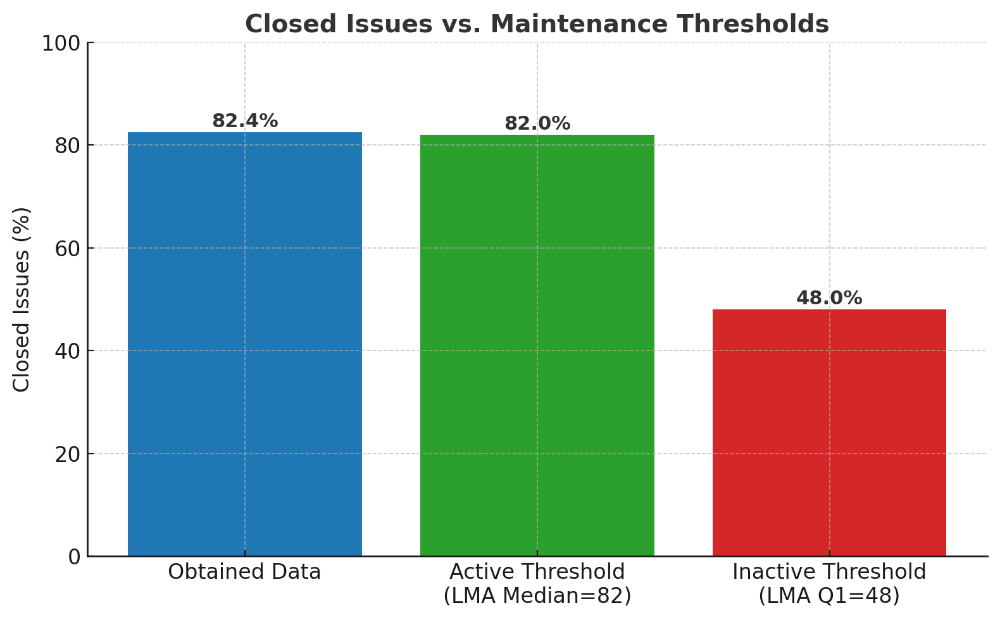
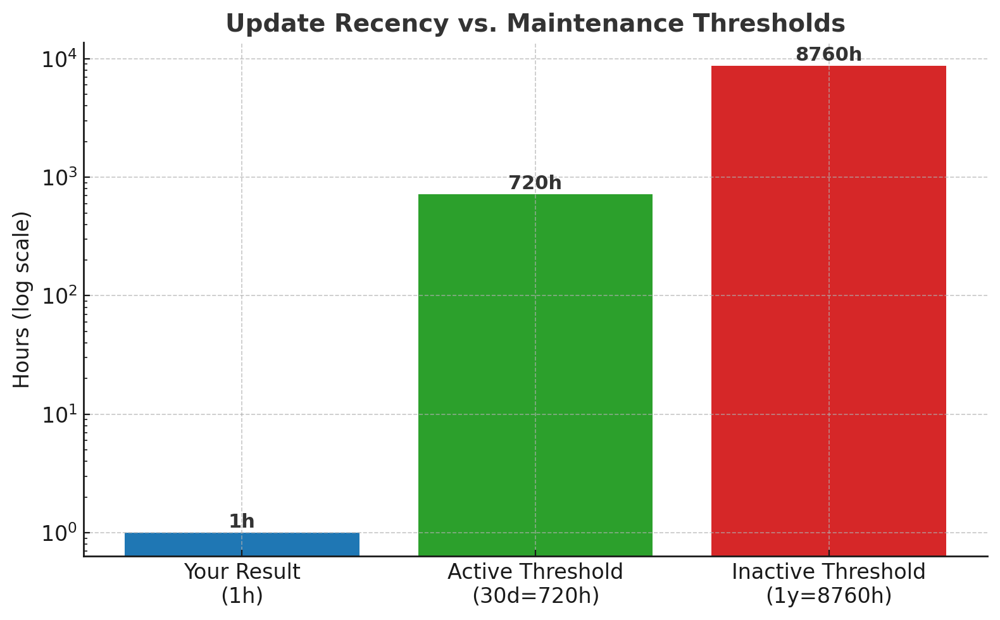
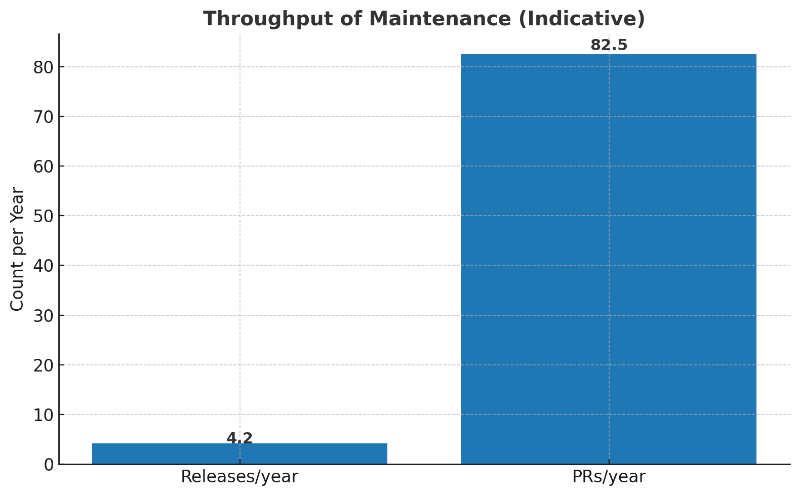

# lab-experimentacao-01

Alunos: João Vitor Romero Sales e Lucas Randazzo

## Introdução

Este estudo investiga características de sistemas populares em repositórios de software do GitHub. O objetivo é compreender se alguns traços que costumam ser associados à popularidade realmente aparecem quando olhamos para os dados. Em especial, observamos aspectos relacionados a:

- ciclo de vida dos projetos (maturidade e frequência de atualização)
- colaboração da comunidade (contribuições externas e tratamento de issues)
- cadência de entrega (lançamento de releases)
- escolha de linguagem primária

Partimos de expectativas intuitivas sobre projetos populares e, na sequência, as confrontamos com evidências obtidas a partir dos dados. Em seguida, sintetizamos os resultados por valores medianos para embasar as conclusões de forma objetiva. Na última etapa, discutimos essas conclusões em comparação com as hipóteses levantadas, destacando convergências, divergências e possíveis explicações.

As expectativas iniciais (hipóteses) são:

- H1 (RQ01): Sistemas populares tendem a ser maduros/antigos, pois tiveram grande exposição (muitas visualizações) e contribuições ao longo do tempo; a popularidade pode estar associada a maior estrutura, boas práticas e documentação consolidada.
- H2 (RQ02): Sistemas populares recebem muita contribuição externa, devido à atuação de comunidades ativas que propõem novas funcionalidades, reportam bugs e sugerem melhorias.
- H3 (RQ03): Sistemas populares lançam releases com frequência, mantendo-se atualizados e funcionais, evitando depreciação e corrigindo eventuais bugs.
- H4 (RQ04): Sistemas populares são atualizados com frequência, em linha com a cadência de releases e a atividade contínua da comunidade.
- H5 (RQ05): Sistemas populares são escritos nas linguagens mais populares, tipicamente linguagens consolidadas como Java, C++ e PHP, ainda que não necessariamente na linguagem mais popular do momento (Python), acreditamos que estas estarão entre as 10 mais utilizadas.
- H6 (RQ06): Sistemas populares possuem alto percentual de issues fechadas, pois contam com muitos contribuidores ativos. Sendo assim, a proporção de issues encerradas em relação às abertas tende a ser maior.

## Metodologia

## Resultados

[Arquivo de dados dos repositórios retornados pela API](data/repository_data.csv "Dados retornados pela chamada da API")

## Discussão

## Trabalhos Relacionados

Tomando como referência os limiares estabelecidos por **Coelho et al. (2020)** no artigo *"Is this GitHub Project Maintained? Measuring the Level of Maintenance Activity of Open-Source Projects"*. O objetivo central dos autores foi propor e validar a métrica **Level of Maintenance Activity (LMA)**, construída a partir de séries temporais de indicadores de repositórios no GitHub (commits, issues, pull requests, releases e atividade de contribuidores). Essa métrica procura responder a uma questão recorrente na literatura: como distinguir, de forma automática e confiável, projetos mantidos de projetos abandonados.

O modelo de LMA desenvolvido por Coelho et al. utiliza múltiplos atributos para gerar um índice contínuo de **0 a 100**, no qual valores mais altos indicam maior probabilidade de um projeto ser mantido ativamente. No conjunto de validação do estudo, projetos com LMA acima de **82 (mediana)** foram classificados como mantidos, enquanto valores próximos ou abaixo de **48 (Q1)** caracterizaram inatividade. O **Q3 (97)** representou projetos com manutenção muito intensa.

A **Figura 1** apresenta a comparação entre o percentual de issues fechadas da nossa amostra e os limiares de LMA descritos pelos autores. Embora nossa coleta não permita calcular o índice LMA diretamente (por exigir séries temporais completas), o percentual de issues fechadas atua como proxy relevante da capacidade de manutenção. O valor mediano obtido foi de **82,4%**, praticamente idêntico à mediana do LMA (82) reportada no artigo. Esse resultado sugere que os repositórios analisados apresentam padrões de resolução de issues compatíveis com aqueles que o estudo classificou como ativamente mantidos.

A **Figura 2** mostra o tempo decorrido desde a última atualização, em horas. Em nossos dados, a mediana foi de apenas **1 hora** desde a última atualização, ao passo que, segundo Coelho et al. (2020), limiares clássicos de inatividade consideram **30 dias (720h)** como ponto de atenção e **1 ano (8760h)** como forte sinal de abandono. Ainda que a métrica de LMA incorpore não apenas a última atualização, mas também a consistência da atividade ao longo do tempo, a discrepância encontrada é evidente: os repositórios analisados apresentam atualização substancialmente mais frequente que os parâmetros de referência, reforçando sua caracterização como plenamente ativos.

A **Figura 3** apresenta o throughput de manutenção (isto é, a quantidade média de entregas e contribuições integradas por ano), considerando a cadência de releases e pull requests mesclados. Observamos uma média de **≈ 4,2 releases/ano** e **≈ 82,5 PRs/ano** em nossa amostra. Embora o artigo de Coelho et al. (2020) não estabeleça limiares fixos para essas métricas isoladamente, os autores destacam que a cadência de releases e a absorção de contribuições externas são componentes-chave do LMA, refletindo a vitalidade de um projeto. Assim, mesmo sem o cálculo formal do índice, nossos resultados reforçam que a amostra se aproxima do perfil de projetos com LMA elevado.

Ao relacionar as métricas coletadas com os limiares propostos por **Coelho et al. (2020)**, verificamos que os repositórios minerados apresentam características compatíveis com projetos altamente mantidos, situando-se entre a **mediana (82)** e o **terceiro quartil (97)** do LMA. A alta taxa de fechamento de issues, a recência extrema das atualizações e o ritmo constante de releases e pull requests corroboram a presença de manutenção contínua e engajamento da comunidade, o que reforça a validade dos nossos resultados frente à literatura.

## Referências

COELHO, F.; WERMELINGER, M.; MELO, F. de; VALENTE, M. T. Is this GitHub Project Maintained? Measuring the Level of Maintenance Activity of Open-Source Projects. In: Proceedings of the 17th International Conference on Mining Software Repositories (MSR '20). ACM, 2020.

